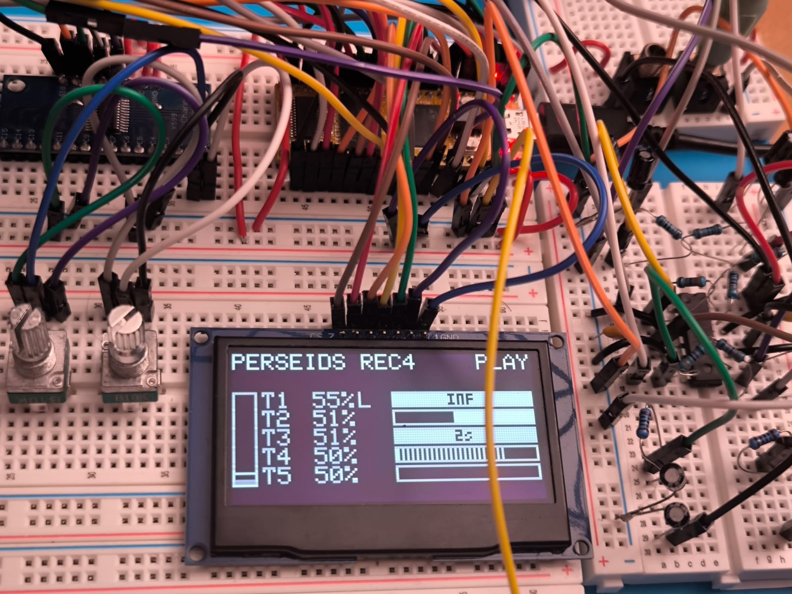

# Perseids

Firmware for **Perseids**, a Eurorack-style granular/spectral audio module on the
Electrosmith Daisy Seed (libDaisy/DaisySP).

Up to 5 audio voices (**Trails**) are captured in a round-robin pool and later processed
by global resynthesis engines (**Spectra** / **Swarm**), resonator, reverb, and filter.
Processing is global and pre-fader; each Trail only has a light mixer tap (Level/Lock/Solo).

Conceptually inspired by [Coastline](https://aqeelaadamsound.com/b/coastline) by Aqeel Aadam
Sound — independently designed, not affiliated.

---

## Status — Phase 5 · `dev-phase5v002`

**Both resynthesis engines are running:** Spectra (additive, FFT 512 + phasor bank) and
Swarm (granular over the Trail SDRAM buffers), switchable A/B via the Engines block.
On top of that, a UI stabilization pass: mux reading now uses libDaisy's native mux
support (no more cross-channel bleed), and Block menus follow a strict single-pot focus
policy (open on cumulative pot travel, only the active pot edits, idle timeout returns
to the Dashboard).



| Area | State |
|------|--------|
| UI / ParameterRegistry / Cycle rows | Working (Trails, Time, Engines, Spectra, Swarm) |
| Trail Level, Lock/Solo, Rec/Trig | Working |
| Capture engine (SDRAM rings, threshold, Cont.Rec, Hold/FIN/FOUT) | Working |
| Dashboard (VU, life bars, Count-limited trails, CPU meter) | Working |
| Spectra engine (additive: Partials, Waveshape, Umbra/Aurora, Ensemble) | Working |
| Swarm engine (granular: Size, Spread, Scan, Atmosphere) | Working |
| Mux/pot input (libDaisy native mux, single-pot menu focus) | Working |
| Engine blend (continuous Spectra↔Swarm) | **Next** — Phase 6 |

Tag: **`dev-phase5v002`** · Full roadmap: [`ARCHITECTURE.md`](./ARCHITECTURE.md)

---

## Hardware

- Electrosmith Daisy Seed (STM32H750, SDRAM)
- SSD1309 OLED 128×64 (SPI)
- Custom carrier PCB (pots, encoders, buttons, jacks)

---

## Building

```bash
git clone https://github.com/xof-112/perseids.git
cd perseids
git checkout dev-phase5v002   # this milestone
git clone --recurse-submodules https://github.com/electro-smith/libDaisy.git lib/libDaisy
git clone https://github.com/electro-smith/DaisySP.git lib/DaisySP
pio run
pio run --target upload
```

---

## License

**GPL-3.0** — see [`LICENSE`](./LICENSE). libDaisy / DaisySP are MIT.
