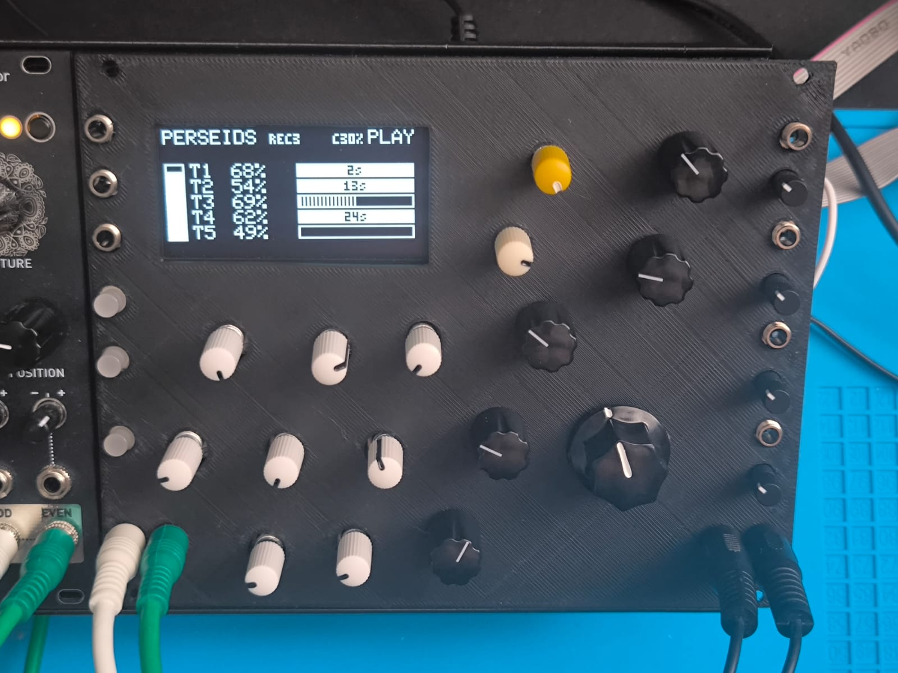

# Perseids

Firmware for **Perseids**, a Eurorack-style granular/spectral audio module on the
Electrosmith Daisy Seed (libDaisy/DaisySP).

Up to 5 audio voices (**Trails**) are captured in a round-robin pool and later processed
by global resynthesis engines (**Spectra** / **Swarm**), resonator, reverb, filter, and
spatial motion (Pan Drift / Crossfade). Processing is global and pre-fader; each Trail
only has a light mixer tap (Level/Lock/Solo).

Conceptually inspired by [Coastline](https://aqeelaadamsound.com/b/coastline) by Aqeel Aadam
Sound — independently designed, not affiliated.

---

## Status — Phase 9 · Pan Drift & Crossfade

**Pan Drift + Crossfade are in.** Block 8 gives each Trail an independent pan LFO
(Phase / Amplitude / Velocity). Block 9 runs a traveling focus lobe across the active
Trails, with focus ticks beside `T#` on the Home dashboard. Soft round-robin replace uses
a BBD-style slew before overwrite.

Also on this bench line (post Phase-8 polish): Swarm load governor (`L!`), grain Direction,
Resonator Damping/Spread with real ring-time Decay, Overwrite (OVR) hold-lock, Daisy
**BOOT_SRAM** bootloader (app in QSPI → AXI-SRAM — internal 128 KB flash was full).



| Area | State |
|------|--------|
| UI / ParameterRegistry / Cycle rows | Working (all 10 block pots; >4 params scroll) |
| Trail Level, Lock/Solo, Rec/Trig, Imprint lock-all | Working |
| Capture engine (SDRAM rings, threshold, Cont.Rec, Hold/FIN/FOUT, OVR) | Working |
| Dashboard (VU, life bars, Count-limited trails, CPU/`L!`, REC header) | Working |
| Spectra engine (additive: Partials, Waveshape, Umbra/Aurora, Ensemble) | Working |
| Swarm engine (granular: Size, Spread, Scan, Direction, Atmosphere) | Working |
| Engine blend (continuous Spectra↔Swarm, equal-power, pre-fader) | Working |
| Spectral Resonator (Mix/Decay/Damping/Spread/Pitch/Quantized) | Working |
| Reverb (ReverbSc + Character) | Working |
| Filter Mix (SVF LP + Destination) | Working |
| Pan Drift (per-Trail LFO, CloudPan) | Working |
| Crossfade (focus lobe + Home ticks) | Working |
| Mod system (4 slots) | **Next** — Phase 10 |
| Multi / Settings / Calibration | Phase 11 |

Tag / photo: **`dev-phase9v002`** · Full roadmap: [`ARCHITECTURE.md`](./ARCHITECTURE.md)

Cheat sheets:

- HTML (bilingual): [`docs/perseids-cheat-sheet.html`](./docs/perseids-cheat-sheet.html)
- PDF DE: [`docs/perseids_cheatsheet_2page.pdf`](./docs/perseids_cheatsheet_2page.pdf)
- PDF EN: [`docs/perseids_cheatsheet_2page_en.pdf`](./docs/perseids_cheatsheet_2page_en.pdf)

---

## Hardware

- Electrosmith Daisy Seed (STM32H750 @ 480 MHz boost, 64 MB SDRAM)
- SSD1309 OLED 128×64 (SPI)
- Custom carrier PCB (pots, encoders, buttons, jacks)

**Bootloader:** the app runs as Daisy `BOOT_SRAM` (binary in QSPI @ `0x90040000`, copied to
AXI-SRAM on boot). Flash the Daisy bootloader once into internal flash; afterward reset into
the ~2 s grace window (hold BOOT to extend) and upload with PlatformIO as usual. ST DFU
(BOOT+RESET) is only needed to reflash the bootloader itself. Details in `ARCHITECTURE.md`
(Block 4 / clock & boot notes).

---

## Building

```bash
git clone https://github.com/xof-112/perseids.git
cd perseids
git checkout dev-phase9v002   # this milestone
git clone --recurse-submodules https://github.com/electro-smith/libDaisy.git lib/libDaisy
git clone --recurse-submodules https://github.com/electro-smith/DaisySP.git lib/DaisySP
# ReverbSc lives in DaisySP-LGPL (LGPL-2.1) — ensure the submodule is present:
#   cd lib/DaisySP && git submodule update --init DaisySP-LGPL

# One-time (if not already on the board): flash Daisy bootloader via ST DFU
#   dfu-util -a 0 -s 0x08000000:leave \
#     -D lib/libDaisy/core/dsy_bootloader_v6_4-intdfu-2000ms.bin -d ,0483:df11

pio run
# Reset Daisy (LED pulses) — hold BOOT to keep the upload window open, then:
pio run --target upload
```

---

## License

**GPL-3.0** — see [`LICENSE`](./LICENSE). libDaisy / DaisySP are MIT; **DaisySP-LGPL**
(`ReverbSc`) is LGPL-2.1.
