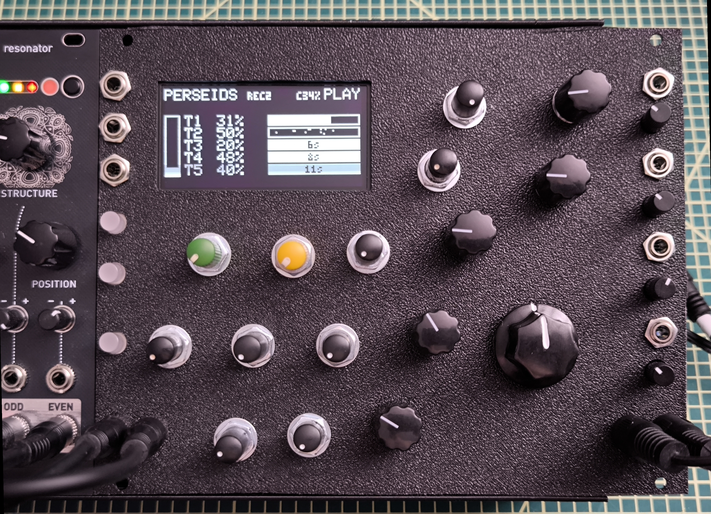

# Perseids

Eurorack-style firmware for the **Electrosmith Daisy Seed** (libDaisy / DaisySP): capture audio
into up to five **Trails**, then shape a stereo cloud with **Spectra** (additive) and **Swarm**
(granular), plus resonator, reverb, filter, and spatial motion.

DSP is **global and pre-fader**; each Trail only has a light mixer tap (Level / Lock / Solo).
**Multi Dry/Wet** is the final blender between clean listen-through and the finished wet bus.

Inspired by [Coastline](https://aqeelaadamsound.com/b/coastline) by Aqeel Aadam Sound —
independently designed, not affiliated.



---

## Status — Phases 1–9 in · bench line `dev-phase5v004`

Phase 9 (**Pan Drift** + **Crossfade**) is complete, together with post-9 polish on the Home
life bar, Multi → Settings defaults, and wet-bus balance. The newest bench line is **Phase 5
follow-up** on the Swarm engine (`dev-phase5v004`); the Spectra analysis rework sits one tag
earlier as `dev-phase4v002`.

| What’s in | Notes |
|-----------|--------|
| Capture (SDRAM rings, THR / CRE / OVR, Hold · FIN · FOUT) | Working |
| Home dashboard (VU Mono or L/R, life bars, REC header, CPU / `L!`) | Working |
| Life-Bar **REC** styles | **PLR** (default) · **PRS** · **CTR** — Settings |
| Spectra · Swarm · Blend · Resonator · Reverb · Filter | Working |
| Pan Drift · Crossfade (focus ticks on Home) | Working |
| Multi (D/W · M1 · M2 · TU · SET) | Cycle short / Cycle-hold+Multi steps the list |
| Settings | CPU · RAM · SCL · INT · **REC** · **VU** · **LVL** · **#T** |
| Default Trail level / count | LVL 0…100% @ 5% · #T 1…5 (boot 3 / 50%) |
| Daisy **BOOT_SRAM** | App in QSPI → AXI-SRAM; room for `-O3` |

| Still ahead | |
|-------------|--|
| **Phase 10** | Mod system (4 slots) |
| **Phase 11** | Multi macros, Time Unit, calibration, FX→Input |

Full roadmap & DSP contracts: [`ARCHITECTURE.md`](./ARCHITECTURE.md)

---

## Phase 5 rework — `dev-phase5v004` (2026-08-04)

Phase 5 built the Swarm engine; this session went back for density, spray control, Blur
character, plus a stuck record-head fix and a stereo input meter.

### Swarm: Size = grain count, Scatter, stronger Blur

- **Size** is now CountNum **4…24** (boot 16) — the concurrent grain pool, not a %-duration.
  Grain length is fixed ~100 ms; spawn rate = length / N so the dialled count is the steady
  density. Cap stays at 24: above that the CPU went critical on the heavy bench. Governor
  floor **6**, engage/panic **88% / 94%**; `L!` only while the live cap sits below Size.
- **Scatter** (`SCT`) is new: 0% = tight on the scan head (±4% jitter), 100% = ±½ loop around
  Scan → full-buffer coverage when wrapped. The old ±2% jitter had parked every grain on the
  same spot, so a quiet region (or a long take’s fade-out tail) could silence the whole cloud.
- **Blur** (Atmosphere left) only softens grain envelopes — no reverb, no pitch shift. The
  plateau is stronger now (pow floor 0.05, mix eased with blur²) so the last third of the pot
  does an audible wash. For “washed out” also raise Scatter / Size; Reverb is a different block.

Cycle list: SIZ · SPR · SCN · SCT · DIR · ATM.

### Cont. Rec + stuck record head

Cont. Rec still fills **Empty** unlocked slots while the signal is above threshold; once the
pool is full it switches to rising-edge behaviour so Overwrite ON cannot immediately re-arm
the take that just finished.

Separately: if `RecordSlotBusy()` stayed true (orphaned Arming/Recording claim), every later
Rec / Threshold / Cont. Rec press was eaten with no feedback. Rec now **force-aborts** a stuck
head before arming; `SanitizeRecordHeads` runs each block to drop index/state mismatches.

### Stereo input VU

Settings → **VU**: **Mon** (single column = max L/R) or **L/R** (two abutting fills in the
same 10×40 frame, no gap; threshold marker still spans the full width). Default **L/R**.

---

## Phase 4 rework — `dev-phase4v002` (2026-08-03)

Phase 4 built the Spectra engine; that session fixed its **analysis** stage, plus one
input-path bug and the cycle menus.

### Spectra: FFT 512 → 2048

The "flea / siren" character of the resynthesis was **not** the peak logic — it was
resolution. At 512 points the bins are 93.75 Hz wide, which puts a 100 Hz fundamental on
bin 1 where it cannot be resolved, shrinks a semitone at 200 Hz to 0.13 bins (so pitch could
never follow the input proportionally), and turns ±1 bin of peak jitter into a jump of more
than a fifth.

2048 points give **23.4 Hz** bins, a 42.7 ms window and a ~21 ms hop; the UI loop now polls
every 10 ms so no hop is missed. The 48 KB of analysis buffers (window, magnitudes,
magnitude EMA, input ring) moved to **SDRAM**, so DTCM usage is unchanged and only the FFT
scratch stays there. `link_cmsis_dsp.py` links the matching lite CMSIS table set
(RFFT 2048 runs a CFFT 1024: `TWIDDLECOEF_F32_1024`, `BITREVIDX_FLT_1024`,
`TWIDDLECOEF_RFFT_F32_2048`).

On top of the resolution, the tracker was made to hold still — *movement should come from the
effects and modulation, never from analysis artefacts*:

- **Continuation before ranking.** A partial that is already sounding keeps its peak, so a
  reshuffle can no longer push the audible fundamental out of the accepted set. That was the
  cause of the abrupt fundamental drop-outs every few seconds on rich material.
- **Hysteresis** on the f0 anchor (keep at −15 dB, win at −9 dB) and on the mono/poly
  decision (3 frames in, 4 frames out). Bare thresholds flipped constantly on dense input.
- **Musical match window** (≈0.75 bin / 3–4%) instead of a wide one, plus an oscillator that
  **jumps** rather than glides when its slot is silent or reassigned by more than 25%. Gliding
  recycled slots were what drew the periodic 200 → 300 Hz sweeps in the spectrogram.

### Perceived-loudness weighting

Partial amplitudes now run through an inverse A-weighting tilt (reference 250 Hz, strength
0.6, floor 0.35). At equal amplitude the ear hears 1–3 kHz far louder than a low fundamental,
so a high-pitched Trail used to outshine lower ones set to the same Level. The tilt only
**attenuates** above the reference — boosting bass would just cost headroom.

### Input routing: the mono-cable grit is gone

A grainy noise faded in with any signal at the input, while the source monitored directly was
clean. Cause: `RecordSource` decided **per sample** which jack was occupied, using a fixed
−80 dBFS threshold — right inside the noise floor of an unconnected input. Whenever that noise
crossed the threshold, the mono gain flipped between 1.0 and 0.5 at audio rate: a random 6 dB
amplitude modulation riding on the signal.

Jack presence is a routing decision, so it now runs **once per block** on an envelope follower
with wide hysteresis (on at −60 dBFS, off at −72 dBFS) and slewed weights (~270 ms).
`CaptureSample` is a plain weighted sum with no branch. A single mono cable still gets full
level, both jacks occupied still get −6 dB.

### Cycle menus: short carousels

The 5-slot carousel (half | full | center | full | half, active pinned to the true screen
middle) wrapped short lists onto themselves. With two entries the **active** parameter also
landed in both rims, so its value visibly moved at the sides while the pot was turned.

A slot is now dropped when its parameter already sits closer to the center. Mirrored slots
share a depth and are therefore always kept or dropped together, so the row stays symmetric
and every entry still slides through the middle in both directions — no direction-dependent
special cases. Dropped slots keep an **empty frame** in the segmented row (same geometry,
no abbreviation, no bar), so every block has the same outline regardless of list length.

Result: Crossfade (2) shows `other | ACTIVE | other`, Pan Drift (3) shows
`prev | ACTIVE | next`, four or more entries fill the window as before.

---

**Cheat sheets** (3-page)

- HTML (EN/DE toggle): [`docs/perseids-cheat-sheet.html`](./docs/perseids-cheat-sheet.html)
- PDF DE: [`docs/perseids_cheatsheet_3page.pdf`](./docs/perseids_cheatsheet_3page.pdf)
- PDF EN: [`docs/perseids_cheatsheet_3page_en.pdf`](./docs/perseids_cheatsheet_3page_en.pdf)

Bench photo: [`images/dev-phase9v003.jpg`](./images/dev-phase9v003.jpg)

---

## Hardware

- Electrosmith Daisy Seed (STM32H750 @ **480 MHz**, 64 MB SDRAM)
- SSD1309 OLED 128×64 (SPI)
- Custom carrier (10 block pots, Multi + 5 Trail encoders, Cycle / Imprint / Rec, jacks)

**Bootloader:** `BOOT_SRAM` — Daisy bootloader in internal flash; app binary at QSPI
`0x90040000`, copied to AXI-SRAM on boot. Reset into the ~2 s upload window (hold **BOOT** to
extend), then PlatformIO upload. ST DFU (BOOT+RESET) only to install/replace the bootloader.
See `ARCHITECTURE.md` §2a / Block 4.

---

## Building

```bash
git clone https://github.com/xof-112/perseids.git
cd perseids
# optional: git checkout <tag>   # e.g. dev-phase5v004

git clone --recurse-submodules https://github.com/electro-smith/libDaisy.git lib/libDaisy
git clone --recurse-submodules https://github.com/electro-smith/DaisySP.git lib/DaisySP
# ReverbSc is LGPL — init DaisySP-LGPL if needed:
#   cd lib/DaisySP && git submodule update --init DaisySP-LGPL

# One-time: flash Daisy bootloader via ST DFU if the Seed is still stock
#   dfu-util -a 0 -s 0x08000000:leave \
#     -D lib/libDaisy/core/dsy_bootloader_v6_4-intdfu-2000ms.bin -d ,0483:df11

pio run
# Reset Daisy (LED pulses) — hold BOOT if needed — then:
pio run --target upload
```

Current bench build at `-O3`: code **38.7%** of the 480 KB AXI-SRAM, `.data`/`.bss`
**58.7%** of the 128 KB DTCM (the tighter budget from here on).

---

## License

**GPL-3.0** — see [`LICENSE`](./LICENSE).  
libDaisy / DaisySP are MIT; **DaisySP-LGPL** (`ReverbSc`) is LGPL-2.1.
