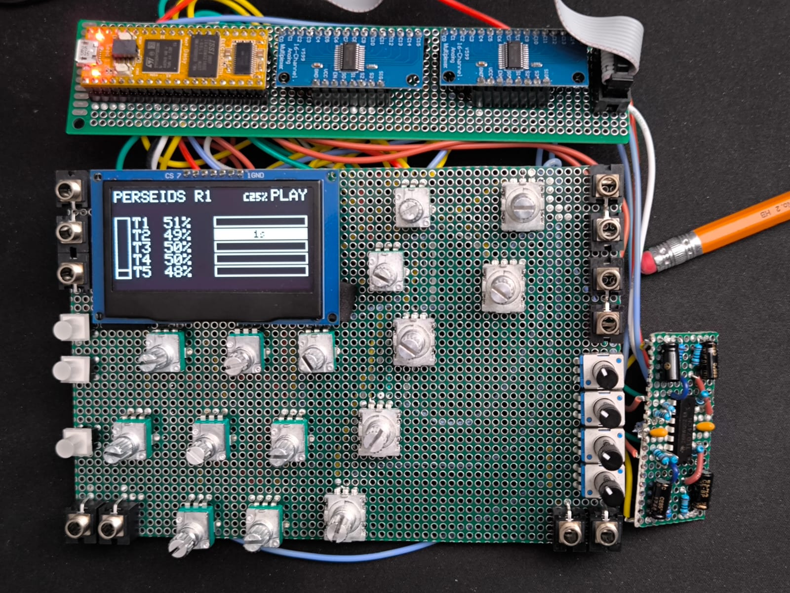

# Perseids

Firmware for **Perseids**, a Eurorack-style granular/spectral audio module on the
Electrosmith Daisy Seed (libDaisy/DaisySP).

Up to 5 audio voices (**Trails**) are captured in a round-robin pool and later processed
by global resynthesis engines (**Spectra** / **Swarm**), resonator, reverb, and filter.
Processing is global and pre-fader; each Trail only has a light mixer tap (Level/Lock/Solo).

Conceptually inspired by [Coastline](https://aqeelaadamsound.com/b/coastline) by Aqeel Aadam
Sound — independently designed, not affiliated.

---

## Status — Phase 8 · Reverb & Filter Mix

**Reverb + Filter Mix are in:** Block 6 runs DaisySP-LGPL `ReverbSc` (Mix / Decay / Damping /
Character Chorus↔Friction). Block 10 is an SVF lowpass with Cutoff / Resonance / Feedback /
Destination (Input→Spectra→Swarm→Reverb). Remaining dummy menus: Pan Drift, Crossfade.



| Area | State |
|------|--------|
| UI / ParameterRegistry / Cycle rows | Working (all 10 block pots) |
| Trail Level, Lock/Solo, Rec/Trig | Working |
| Capture engine (SDRAM rings, threshold, Cont.Rec, Hold/FIN/FOUT) | Working |
| Dashboard (VU, life bars, Count-limited trails, CPU meter) | Working |
| Spectra engine (additive: Partials, Waveshape, Umbra/Aurora, Ensemble) | Working |
| Swarm engine (granular: Size, Spread, Scan, Atmosphere) | Working |
| Engine blend (continuous Spectra↔Swarm, equal-power, pre-fader) | Working |
| Spectral Resonator (on Swarm: Mix/Decay/Pitch/Quantized + Settings Scale/Intonation) | Working |
| Reverb (ReverbSc + Character) | Working |
| Filter Mix (SVF LP + Destination) | Working |
| Blocks 8–9 (Pan Drift, Crossfade) | Dummy menus — Phase 9 |
| Pan Drift & Crossfade | **Next** — Phase 9 |

Tag: **`dev-phase6v001`** (bench photo) · Full roadmap: [`ARCHITECTURE.md`](./ARCHITECTURE.md)

---

## Hardware

- Electrosmith Daisy Seed (STM32H750, SDRAM)
- SSD1309 OLED 128×64 (SPI)
- Custom carrier PCB (pots, encoders, buttons, jacks)

---

## Building

```bash
git clone https://github.com/xof-112/perseids.git
cd perseids
git checkout dev-phase6v001   # this milestone
git clone --recurse-submodules https://github.com/electro-smith/libDaisy.git lib/libDaisy
git clone --recurse-submodules https://github.com/electro-smith/DaisySP.git lib/DaisySP
# ReverbSc lives in DaisySP-LGPL (LGPL-2.1) — ensure the submodule is present:
#   cd lib/DaisySP && git submodule update --init DaisySP-LGPL
pio run
pio run --target upload
```

---

## License

**GPL-3.0** — see [`LICENSE`](./LICENSE). libDaisy / DaisySP are MIT; **DaisySP-LGPL**
(`ReverbSc`) is LGPL-2.1.
